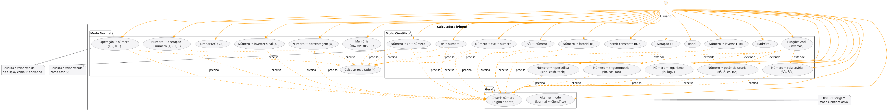
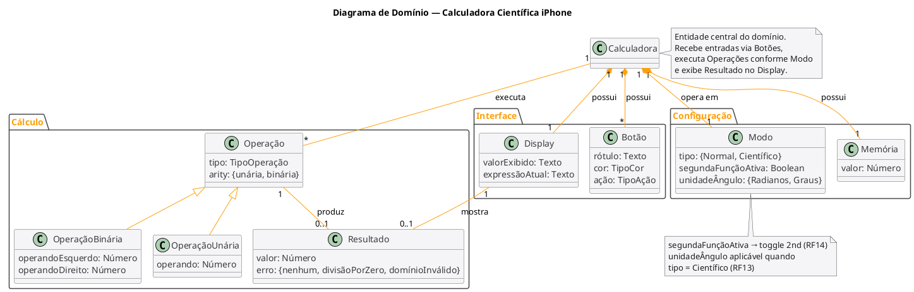

# Análise Orientada a Objeto

> A **análise** orientada a objeto consiste na descrição do problema a ser tratado, a definição de casos de uso e a definição do domínio do problema.

---

## Descrição Geral do Domínio do Problema

A **Calculadora Científica iPhone** é um sistema de software que simula o comportamento da calculadora nativa do iPhone, oferecendo dois modos de operação: **Normal** e **Científico**. O usuário interage com botões na interface gráfica para inserir números, selecionar operações e obter resultados numéricos exibidos em um display.

### Requisitos Funcionais

| ID | Requisito |
|----|-----------|
| RF01 | O sistema deve realizar as quatro operações aritméticas básicas: adição, subtração, multiplicação e divisão. |
| RF02 | O sistema deve suportar operações de memória: armazenar (m+), subtrair da memória (m-), recuperar (mr) e limpar (mc). |
| RF03 | O sistema deve permitir limpar a entrada atual (CE) e resetar completamente o estado (AC). |
| RF04 | O sistema deve calcular porcentagem (%) e inverter o sinal (+/-) do valor exibido. |
| RF05 | No modo científico, o sistema deve calcular funções trigonométricas: sin, cos, tan e suas inversas (asin, acos, atan). |
| RF06 | No modo científico, o sistema deve calcular funções hiperbólicas: sinh, cosh, tanh e suas inversas. |
| RF07 | No modo científico, o sistema deve calcular logaritmos natural (ln) e na base 10 (log₁₀). |
| RF08 | No modo científico, o sistema deve calcular potências: x², x³, xʸ, eˣ, 10ˣ. |
| RF09 | No modo científico, o sistema deve calcular raízes: ²√x, ³√x, ʸ√x. |
| RF10 | No modo científico, o sistema deve calcular fatorial (x!) e inverso (1/x). |
| RF11 | No modo científico, o sistema deve inserir as constantes π e e. |
| RF12 | O sistema deve alternar entre modo Normal e Científico por meio de um botão de toggle. |
| RF13 | O sistema deve alternar a unidade de ângulo entre Radianos e Graus. |
| RF14 | O sistema deve exibir a função "2nd" para alternar para funções inversas dos botões científicos. |
| RF15 | O sistema deve suportar notação científica (EE) e geração de número aleatório (Rand). |
| RF16 | O sistema deve tratar erros como divisão por zero e domínio inválido (ex.: raiz de negativo). |

### Requisitos Não-Funcionais

| ID | Requisito |
|----|-----------|
| RNF01 | A interface deve ser inspirada visualmente na calculadora do iPhone: fundo preto, botões arredondados, operadores em laranja (#FF9F0A), botões de função em cinza escuro (#636366) e dígitos em cinza médio (#3A3A3C). |
| RNF02 | O sistema deve ser implementado em C++17 com framework Qt 6. |
| RNF03 | A engine de cálculo deve ser completamente desacoplada da interface gráfica. |
| RNF04 | O código deve demonstrar: herança, polimorfismo virtual, sobrecarga de operadores e uso de STL (`std::stack`, `std::map`, `std::vector`). |
| RNF05 | O sistema deve ser compilável via CMake em ambiente Linux. |
| RNF06 | O painel científico deve expandir/recolher com animação ao alternar o modo. |

---

## Diagrama de Casos de Uso

O diagrama abaixo identifica o único ator do sistema (**Usuário**) e todas as funcionalidades disponíveis, organizadas por modo de operação.

> Fonte: [`docs/usecase.puml`](docs/usecase.puml)

### Descrição dos Casos de Uso Principais

#### UC02 — Cálculo binário: número → operação → número

| Campo | Descrição |
|-------|-----------|
| **Ator** | Usuário |
| **Pré-condição** | Display disponível |
| **Fluxo principal** | 1. Usuário insere o primeiro operando (UC01) → 2. Pressiona operador (+, -, ×, ÷) → 3. Insere o segundo operando (UC01) → 4. Pressiona "=" (UC03) → 5. Sistema exibe o resultado |
| **Exceção** | Divisão por zero: sistema exibe "Erro" |

#### UC02b — Cálculo binário: operação → número

| Campo | Descrição |
|-------|-----------|
| **Ator** | Usuário |
| **Pré-condição** | Valor exibido no display (resultado anterior ou 0) |
| **Fluxo principal** | 1. Usuário pressiona operador (+, -, ×, ÷) → 2. Sistema usa o valor do display como 1º operando → 3. Usuário insere o segundo operando (UC01) → 4. Pressiona "=" (UC03) → 5. Sistema exibe o resultado |
| **Exceção** | Divisão por zero: sistema exibe "Erro" |

#### UC08 — Aplicar função trigonométrica (número → função)

| Campo | Descrição |
|-------|-----------|
| **Ator** | Usuário |
| **Pré-condição** | Modo Científico ativo; operando válido inserido |
| **Fluxo principal** | 1. Usuário insere o ângulo (UC01) → 2. Pressiona sin, cos ou tan → 3. Sistema aplica a função conforme unidade de ângulo ativa (Rad/Grau) → 4. Resultado exibido |
| **Extensão (2nd)** | UC19 estende para funções inversas: asin, acos, atan |

---

## Diagrama de Domínio do Problema

O diagrama conceitual abaixo representa as entidades do domínio e seus relacionamentos, sem ainda comprometer com a implementação técnica.

> Fonte: [`docs/domain.puml`](docs/domain.puml)

### Análise do Domínio

- **Calculadora**: entidade central que coordena todo o fluxo. Mantém referência ao modo atual, à memória e ao display.
- **Display**: responsável por exibir o valor corrente e a expressão em construção.
- **Operação**: conceito abstrato que representa qualquer cálculo. Divide-se em **Operação Binária** (dois operandos, ex.: 3 + 5) e **Operação Unária** (um operando, ex.: sin(π/2)).
- **Botão**: elemento de entrada do usuário. Cada botão possui um rótulo, uma cor visual e uma ação associada.
- **Memória**: armazena um valor numérico acessível pelas funções mc/m+/m-/mr.
- **Resultado**: encapsula o valor calculado e indica se ocorreu algum erro.
- **Modo**: além do tipo Normal/Científico, define o toggle 2nd (`segundaFunçãoAtiva`) e a unidade de ângulo (`unidadeÂngulo`: Radianos ou Graus) quando o modo científico está ativo.

---

[Retroceder](README.md) | [Avançar](projeto.md)

