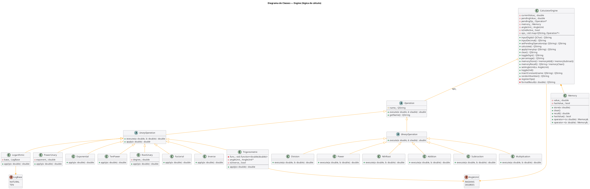
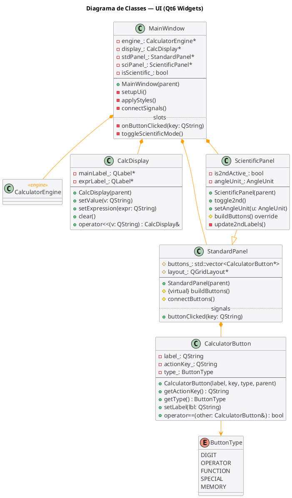
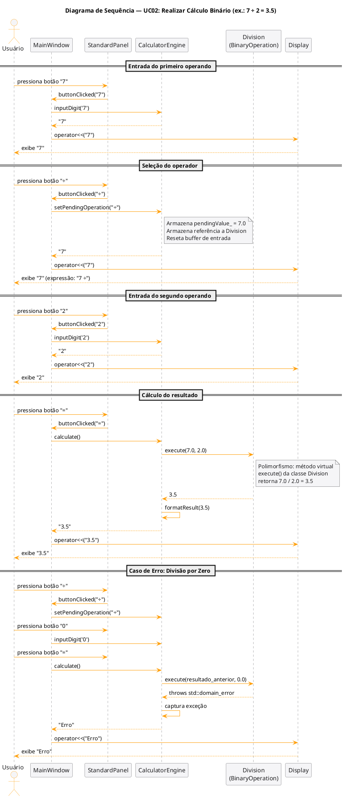

# Projeto Orientado a Objeto

> O **Projeto orientado a objeto** é composto pelas documentação do projeto descrito em UML. Inclui o Diagrama de Classes do sistema projetado e diagramas de interação dos casos de uso.

---

## Decisões de Projeto

A arquitetura do sistema é dividida em duas camadas claramente separadas:

- **`engine/`**: contém toda a lógica de cálculo em C++ puro, sem dependências de Qt. Isso garante testabilidade e reutilização independente de interface.
- **`ui/`**: contém os componentes Qt que apresentam a interface ao usuário e delegam todas as operações numéricas ao engine.

### Padrões Aplicados

| Padrão / Conceito POO | Onde é aplicado |
|---|---|
| **Herança** | `BinaryOperation` e `UnaryOperation` herdam de `Operation`; `ScientificPanel` herda de `StandardPanel` |
| **Polimorfismo virtual** | `Operation::execute()` é virtual puro; cada subclasse implementa sua própria lógica |
| **Encapsulamento** | `CalculatorEngine` expõe apenas uma API de alto nível; toda a lógica interna (pilha, mapa de operações, histórico) é privada |
| **Sobrecarga de operadores** | `Memory::operator+` e `operator-` para m+/m-; `Display::operator<<` para atualização do valor exibido |
| **STL** | `std::stack<double>` para avaliação de expressões; `std::map<QString, Operation*>` para despacho de operações; `std::vector<CalculatorButton*>` nos painéis |
| **Composição** | `MainWindow` contém `CalculatorEngine`, `Display`, `StandardPanel` e `ScientificPanel` |
| **std::function** | Funções trigonométricas e hiperbólicas encapsuladas em `std::function<double(double)>` dentro de `Trigonometric` |

---

## Diagrama de Classes

O diagrama foi dividido em duas visões complementares para melhor legibilidade.

**Engine — hierarquia de operações e lógica de cálculo:**



> Fonte: [`docs/classes_engine.puml`](docs/classes_engine.puml)

**UI — componentes Qt e suas relações:**



> Fonte: [`docs/classes_ui.puml`](docs/classes_ui.puml)

### Hierarquia de `Operation`

```
Operation  (abstract)
├── BinaryOperation  (abstract)
│   ├── Addition          (+)
│   ├── Subtraction       (-)
│   ├── Multiplication    (×)
│   ├── Division          (÷)  ← lança std::domain_error se divisor == 0
│   ├── Power             (xʸ, binária)
│   └── NthRoot           (ʸ√x, binária)
└── UnaryOperation  (abstract)
    ├── Trigonometric     (sin, cos, tan, asin, acos, atan, sinh, cosh, tanh, ...)
    ├── Logarithmic       (ln, log₁₀)
    ├── PowerUnary        (x², x³, eˣ, 10ˣ, 1/x equivalente a x⁻¹)
    ├── RootUnary         (²√x, ³√x)
    ├── Factorial         (x!)
    └── Inverse           (1/x)
```

### Responsabilidades do `CalculatorEngine`

O engine mantém um estado de máquina de estados implícita:

```
[Aguardando entrada] → [Digitando operando] → [Operador selecionado]
        ↑                                               ↓
        └──────────────── [Resultado exibido] ←─────────┘
```

Internamente usa `std::map<QString, Operation*>` inicializado no construtor via `registerOps()`, permitindo despacho de qualquer operação por nome de forma polimórfica.

---

## Diagrama de Sequência — UC01: Realizar Cálculo Binário

O diagrama abaixo mostra o fluxo completo para a operação **7 ÷ 2 = 3.5**, incluindo o tratamento do caso de erro (divisão por zero).



> Fonte: [`docs/sequence.puml`](docs/sequence.puml)

### Pontos Relevantes do Diagrama

1. **Desacoplamento**: `MainWindow` nunca acessa `Division` diretamente — sempre chama métodos de alto nível do `CalculatorEngine`.
2. **Polimorfismo em ação**: a chamada `execute(7.0, 2.0)` é resolvida em tempo de execução para `Division::execute()`, demonstrando despacho virtual.
3. **Tratamento de exceção**: `Division` lança `std::domain_error` na divisão por zero; `CalculatorEngine` captura e retorna a string `"Erro"` para a UI.
4. **Sobrecarga `operator<<`**: `Display::operator<<` permite a notação `disp << "3.5"` para atualização do display.

---

<div align="center">

[Retroceder](analise.md) | [Avançar](implementacao.md)

</div>
